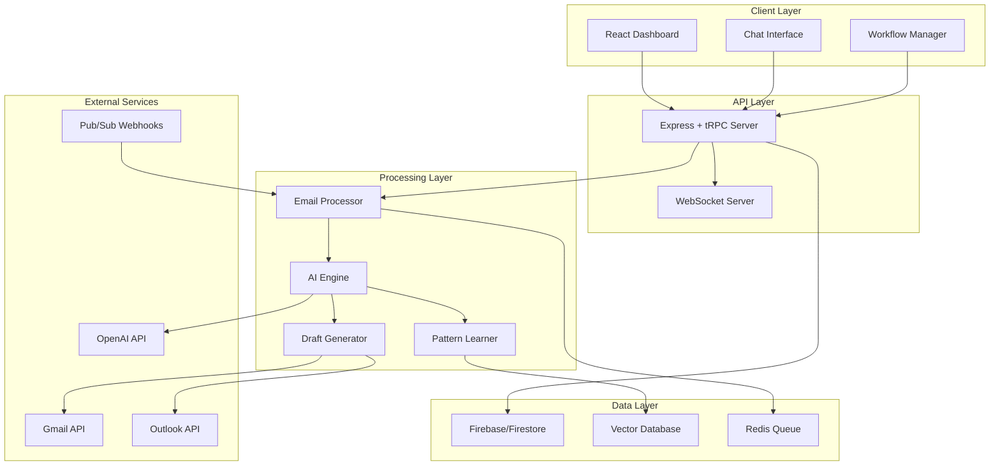

# Design Document

## Overview

The AI Email Workforce system is designed as a scalable, real-time email automation platform that learns user patterns and generates contextual responses. The architecture follows a microservices-inspired approach while maintaining simplicity for the MVP phase, with clear paths for scaling to a full AI workforce platform.

## Architecture

### High-Level System Architecture



### Core Components

#### 1. Email Integration Layer
- **Gmail Service**: Handles Gmail API interactions, OAuth, and webhook processing
- **Outlook Service**: Manages Microsoft Graph API integration
- **Webhook Handler**: Processes real-time email notifications
- **Token Manager**: Securely stores and refreshes OAuth tokens

#### 2. AI Processing Engine
- **Pattern Analyzer**: Extracts communication patterns from historical emails
- **Context Matcher**: Finds similar past conversations using vector embeddings
- **Response Generator**: Creates contextual draft responses using GPT-4o
- **Learning Engine**: Continuously improves from user feedback and edits

#### 3. Workflow Management
- **Workflow Detector**: Identifies recurring email patterns and processes
- **Template Manager**: Stores and manages response templates
- **Document Tracker**: Associates documents with specific workflows
- **Rule Engine**: Applies user-defined rules and preferences

## Components and Interfaces

### Email Processing Pipeline

```typescript
interface EmailProcessor {
  processNewEmail(emailData: IncomingEmail): Promise<ProcessingResult>
  analyzeEmailContent(content: string): Promise<EmailAnalysis>
  generateDraftResponse(analysis: EmailAnalysis, context: UserContext): Promise<DraftResponse>
  saveDraftToProvider(draft: DraftResponse, provider: EmailProvider): Promise<string>
}

interface IncomingEmail {
  id: string
  provider: 'gmail' | 'outlook'
  from: string
  to: string[]
  subject: string
  content: string
  threadId?: string
  attachments: Attachment[]
  receivedAt: Date
}

interface EmailAnalysis {
  intent: 'question' | 'request' | 'information' | 'meeting' | 'other'
  urgency: 'low' | 'medium' | 'high'
  sentiment: 'positive' | 'neutral' | 'negative'
  entities: ExtractedEntity[]
  suggestedWorkflow?: string
  requiresResponse: boolean
  confidence: number
}

interface DraftResponse {
  content: string
  subject?: string
  attachments: string[]
  confidence: number
  workflowUsed?: string
  reasoning: string
}
```

### AI Learning System

```typescript
interface PatternLearner {
  analyzeHistoricalEmails(emails: HistoricalEmail[]): Promise<LearnedPatterns>
  updatePatternsFromFeedback(originalDraft: string, userEdit: string): Promise<void>
  findSimilarContexts(emailContent: string): Promise<SimilarContext[]>
  extractWorkflowPatterns(emailSequence: Email[]): Promise<WorkflowPattern[]>
}

interface LearnedPatterns {
  communicationStyle: CommunicationStyle
  commonPhrases: string[]
  workflowTemplates: WorkflowTemplate[]
  documentAssociations: DocumentAssociation[]
  responsePatterns: ResponsePattern[]
}

interface WorkflowTemplate {
  id: string
  name: string
  triggerConditions: TriggerCondition[]
  responseTemplate: string
  requiredDocuments: string[]
  followUpActions: FollowUpAction[]
  usageCount: number
  successRate: number
}
```

### Real-Time Communication

```typescript
interface WebSocketEvents {
  'email:received': IncomingEmail
  'draft:generated': { emailId: string; draft: DraftResponse }
  'workflow:detected': { emailId: string; workflow: WorkflowTemplate }
  'learning:updated': { type: string; improvement: string }
  'processing:status': { emailId: string; status: ProcessingStatus }
}

interface ChatInterface {
  processUserMessage(message: string, context: UserContext): Promise<ChatResponse>
  getEmailInsights(query: string): Promise<EmailInsights>
  updateWorkflowViaChat(instruction: string): Promise<WorkflowUpdate>
  generateEmailSummary(timeframe: string): Promise<EmailSummary>
}
```

## Data Models

### User and Account Management

```typescript
interface User {
  id: string
  email: string
  createdAt: Date
  subscription: SubscriptionTier
  preferences: UserPreferences
  connectedAccounts: ConnectedAccount[]
}

interface ConnectedAccount {
  id: string
  provider: 'gmail' | 'outlook'
  email: string
  accessToken: string // encrypted
  refreshToken: string // encrypted
  isActive: boolean
  lastSyncAt: Date
  learningStatus: 'pending' | 'learning' | 'complete'
}

interface UserPreferences {
  responseStyle: 'formal' | 'casual' | 'auto'
  autoGenerateDrafts: boolean
  confidenceThreshold: number
  excludedSenders: string[]
  workflowNotifications: boolean
  learningEnabled: boolean
}
```

### Email and Pattern Storage

```typescript
interface EmailPattern {
  id: string
  userId: string
  patternType: 'response' | 'workflow' | 'document'
  triggerKeywords: string[]
  responseTemplate: string
  confidence: number
  usageCount: number
  lastUsed: Date
  embedding: number[] // vector representation
}

interface ProcessedEmail {
  id: string
  userId: string
  originalEmailId: string
  provider: string
  analysis: EmailAnalysis
  generatedDraft?: DraftResponse
  userFeedback?: UserFeedback
  processedAt: Date
  processingTime: number
}

interface UserFeedback {
  draftAccepted: boolean
  userEdits?: string
  rating: 1 | 2 | 3 | 4 | 5
  feedback?: string
  submittedAt: Date
}
```

## Error Handling

### Graceful Degradation Strategy

1. **Webhook Failures**: Automatic fallback to polling with user notification
2. **AI Service Outages**: Queue requests and process when service returns
3. **Rate Limiting**: Implement exponential backoff with user-visible status
4. **Token Expiration**: Automatic refresh with re-authentication prompts
5. **Processing Failures**: Save email for manual review with error context

### Error Recovery Patterns

```typescript
interface ErrorHandler {
  handleWebhookFailure(error: WebhookError): Promise<FallbackStrategy>
  handleAIServiceError(error: AIServiceError): Promise<RetryStrategy>
  handleRateLimitError(error: RateLimitError): Promise<BackoffStrategy>
  handleTokenError(error: TokenError): Promise<ReauthStrategy>
}

interface ProcessingError {
  emailId: string
  errorType: 'webhook' | 'ai' | 'rate_limit' | 'token' | 'unknown'
  errorMessage: string
  retryCount: number
  nextRetryAt?: Date
  requiresUserAction: boolean
}
```

## Testing Strategy

### Unit Testing
- **AI Components**: Mock OpenAI responses, test pattern matching logic
- **Email Services**: Mock Gmail/Outlook APIs, test OAuth flows
- **Pattern Learning**: Test with synthetic email data, validate learning accuracy
- **Draft Generation**: Test response quality with various email types

### Integration Testing
- **End-to-End Workflows**: Test complete email processing pipeline
- **Webhook Processing**: Test real-time email handling with test accounts
- **Multi-Provider**: Test Gmail and Outlook integration simultaneously
- **Performance**: Load testing with high email volumes

### AI Testing Strategy
- **Response Quality**: A/B testing of generated drafts vs. user preferences
- **Learning Accuracy**: Track improvement in draft acceptance rates over time
- **Pattern Recognition**: Validate workflow detection with known email sequences
- **Confidence Calibration**: Ensure confidence scores correlate with user satisfaction

### Security Testing
- **Token Security**: Verify encryption/decryption of OAuth tokens
- **Data Privacy**: Ensure no sensitive data leaks to AI services
- **Access Control**: Test user isolation and data segregation
- **Webhook Security**: Validate webhook signature verification

## Performance Considerations

### Scalability Targets
- **Users**: Support 1,000+ concurrent users
- **Email Volume**: Process 100,000+ emails per day
- **Response Time**: Generate drafts within 10 seconds
- **Learning Speed**: Complete initial learning within 24 hours

### Optimization Strategies
- **Caching**: Cache user patterns and frequently used templates
- **Batch Processing**: Group similar emails for efficient AI processing
- **Connection Pooling**: Optimize database and API connections
- **CDN**: Serve static assets and embeddings from CDN

### Monitoring and Metrics
- **Processing Latency**: Track email-to-draft generation time
- **AI Accuracy**: Monitor draft acceptance and edit rates
- **System Health**: Track API response times and error rates
- **User Engagement**: Monitor feature usage and satisfaction scores